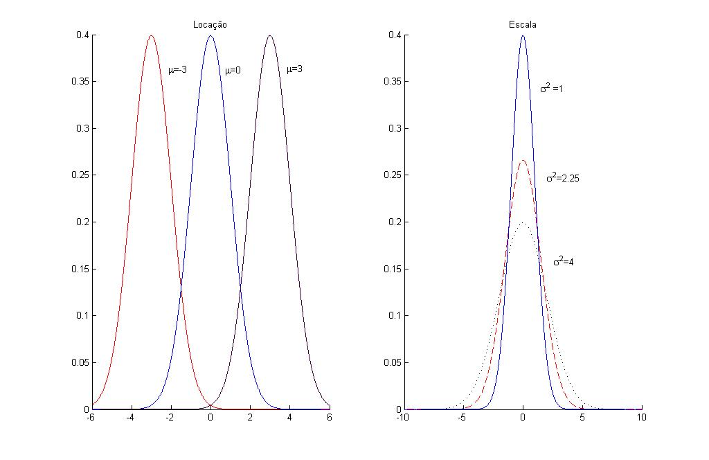

# Introdução {#intro}

## Breve introdução ao R 

Das linguagems de programação voltadas a manipulação, vizualização e análises de dados, o R é umas das mais difundidas entre a comunidade Estatística. Outras linguagens, como o Python, tem um apelo maior quando se trata de ciência de dados, no seu sentido mais amplo.

## Aleatoriedade, a essência da Estatística 

Para iniciar qualquer curso em que são utilizadas técnicas estatísticas, é necessário
esclarecer/fundamentar bem o conceito de aleatoriedade. 

> *Na história antiga, os conceitos de chance e de aleatoriedade eram interligados ao conceito que era atribuído a destino. Várias pessoas da antiguidade jogavam dados para   determinarem o destino, e posteriormente isso se desenvolveu em jogos de azar. A maioria das culturas usaram vários métodos de adivinhações para tentarem contornar a aleatoriedade e o destino, ou mesmo a dita sorte. A palavra aleatoriedade é utilizada para exprimir quebra de ordem, propósito, causa, ou imprevisibilidade em uma terminologia não científica. Um processo aleatório é o processo repetitivo cujo resultado não descreve um padrão determinístico, mas segue uma distribuição de probabilidade [Wikipédia](https://pt.wikipedia.org/wiki/Aleatoriedade).*

(\#fig:dados)Dados

As técnicas estatísticas surgem para encontrar algum *padrão de variação*. Para tal tarefa é necessário formalizar e definir alguns conceitos, como são os casos de variável aleatória e distribuição de probabilidade.

## Variável aleatória

Denomina-se **variável** uma propriedade (característica) qualquer das unidades da população para a qual foi definida uma unidade de medida, que pode ser quantitativa ou qualitativa. Observe que essa característica é comum a todos os indivíduos e portanto é uma característica da população. Em geral, queremos fazer afirmações sobre características e temos apenas informações de alguns indivíduos (amostra). Assim, toda afirmação feita a partir de uma amostra é passível de erros, ou seja, é uma
aproximação. Além disso, em alguns casos não é possível "medir" toda a população e devemos pensar nessa característica como uma quantidade aleatória. Para isso, é necessário introduzirmos o
conceito de _**variável aleatória**_.

\BeginKnitrBlock{definition}\iffalse{-91-69-115-112-97-231-111-32-65-109-111-115-116-114-97-108-93-}\fi{}
<strong>(\#def:EspacoAmostral)  \iffalse (Espaço Amostral) \fi{} </strong>Espaço amostral de um *experimento aleatório* (fenômeno que, mesmo repetidos várias vezes sob condições semelhantes, apresentam resultados imprevisíveis) é **qualquer** conjunto contendo todos os possíveis resultados do experimento. Aqui, sempre que não houver perigo de confusão, o espaço amostral de um experimento em questão será denotado por $\Omega$.
\EndKnitrBlock{definition}

 

\BeginKnitrBlock{example}
<strong>(\#exm:exampcel) </strong>No seguinte experimento:  derrubar o celular e observar a face voltada para cima, o espaço amostral é o conjunto $\{\mathrm{Frontal}, \mathrm{Costas}\}$.
\EndKnitrBlock{example}

 

\BeginKnitrBlock{example}
<strong>(\#exm:edados) </strong>Se o experimento é lançar um dado de seis faces, o espaço amostral é $\{1,2,3,4,5,6\}$.
\EndKnitrBlock{example}

 

\BeginKnitrBlock{example}
<strong>(\#exm:exampespamost) </strong>Poderá perfeitamente existir mais de um espaço amostral adequado para um determinado experimento. No Exemplo \@ref(exm:edados), o conjunto $\{1,2,3,4,5,6,7\}$ contém todos os possíveis resultados do experimento em questão (lançar um dado de seis faces). Assim, pela definição \@ref(def:EspacoAmostral), este conjunto é tão adequado como espaço amostral quanto o conjunto mais intuitivo $\{1,2,3,4,5,6\}$. Até mesmo o conjunto dos números reais $\mathbb{R}$ é adequado. Obviamente, sempre que possível é recomendável utilizar o conjunto mais *natural* como espaço amostral, porém, do ponto de vista teórico, desde que o conjunto escolhido efetivamente contenha todos os possíveis resultados do experimento, não faz diferença alguma qual conjunto se está utilizando.
\EndKnitrBlock{example}

 

\BeginKnitrBlock{example}
<strong>(\#exm:examexp) </strong>Nos exemplos anteriores, é possível (e muito fácil) determinar exatamente quais são todos os possíveis resultados dos experimentos em questão. Porém nem sempre este é o caso. Considere o experimento em que uma pessoa é escolhida ao acaso e sua altura (em metros) medida. Neste caso é difícil determinar precisamente o conjunto contendo exatamente todos os possíveis resultados do experimento. Com certeza o conjunto $[0,10]$ contém todas as possíveis alturas a serem registradas. O conjunto $[0,3]$ também. Por outro lado, será que o conjunto $[0,2.7]$ é apropriado? E $(0.3,2.7)$?
\EndKnitrBlock{example}

Todo subconjunto de um espaço amostral é chamado *evento*. Os
subconjuntos de um espaço amostral contendo apenas um elemento são
chamados de *eventos elementares*.

Por exemplo, no lançamento de um dado de seis faces, $\{5\}$ é um evento elementar. Outro evento possível é: *a face superior é ímpar*, o que é equivalente ao subconjunto $\{1,3,5\}\subset\Omega$. Outra possibilidade poderia ser verificar se a face obtida é superior a 3.

Existem ainda experimentos que podem ser vistos como "compostos" por natureza, como por exemplo o lançamento independente de um dado de seis faces e de uma moeda honesta, no qual anotamos a face superior do dado e a face da moeda. Neste caso, é fácil determinar um espaço amostral associado ao experimento que contenha exatamente todos os resultados possíveis. Este constituirá de pares contendo um número inteiro de 0 à 6, correspondente ao lançamento do dado e um elemento do conjunto $\{\mathrm{Frontal},\mathrm{Costas}\}$, correspondente à queda do celular, ou seja, $\Omega=\{(1, \mathrm{Frontal}), (1,\mathrm{costas}), \cdots, (6, \mathrm{Frontal}), (6,\mathrm{Costas})\}$. Uma outra maneira de representar isto é a partir do produto cartesiano dos espaços amostrais de cada um dos experimentos individuais, neste caso $\Omega=\{1,2,3,4,5,6\}\times\{\mathrm{Frontal},\mathrm{Costas}\}$.

Espaços amostrais são importantes na definição de um *espaço de probabilidade*. Um espaço de probabilidade $(\Omega, \mathcal{F},\mathcal{P})$ onde $\Omega$ denota um espaço amostral qualquer, $\mathcal{F}$ é um conjunto de eventos associado à $\Omega$ satisfazendo certas propriedades ($\sigma$-algebra de eventos), e $\mathcal{P}:\mathcal{F}\rightarrow[0,1]$ uma medida de probabilidade atribuindo valores em $[0,1]$ para cada evento de interesse em $\mathcal{F}$ (a probabilidade dos eventos).

> _Uma **variável aleatória**  é uma função do espaço amostral
$\Omega$ nos reais, para a qual é possível calcular a
probabilidade de ocorrência de seus valores. Em geral, as
variáveis aleatórias são representadas por letras maiúsculas do
fim do alfabeto. Temos, para cada elemento $\omega \in \Omega$, um
número real $X(\omega)$ conforme a Figura \@ref(fig:dados)._

(\#fig:va)Variável aleatória

Garantimos o cálculo de probabilidades com variáveis aleatórias ao exigir que, para qualquer $I \subset \mathbb{R}$, o conjunto $X^{-1}(I)$ seja um evento. Em outras palavras, o conjunto $X^{-1}(I)$ é um
elemento de $\mathcal{F}$, ou seja, $X^{-1}(I) \in \mathcal{F}$. Lembremos que apenas os elementos de
$\mathcal{F}$ têm atribuição de probabilidade. Em linguagem mais matemática, dizemos que uma variável aleatória é qualquer função mensurável em $(\Omega,\mathcal{F})$. Isto justifica dizer que a
variável $X$ é $\mathcal{F}$-\emph{mensuravel}. Com frequência, faz-se menção ao espaço de probabilidade $(\Omega, \mathcal{F},\mathcal{P})$, para deixar claro o espaço amostral, a $\sigma$-álgebra e a probabilidade envolvidas. Formalmente, definimos

 

\BeginKnitrBlock{definition}
<strong>(\#def:Def1) </strong>Seja $(\Omega, \mathcal{F}, \mathcal{P})$ um espaço de
probabilidade. Denominamos de variável aleatória, qualquer função
$X:\Omega \rightarrow \mathbb{R}$ tal que
\begin{equation*}
    X^{-1}(I)=\{\omega \in \Omega : X(\omega) \in I\} \in
    \mathcal{F},
\end{equation*}
para todo intervalo $I \subset \mathbb{R}$. Em palavras, $X$ é tal que sua
imagem inversa de intervalos $I \subset \mathbb{R}$ pertencem a
$\sigma$-álgebra $\mathcal{F}$.
\EndKnitrBlock{definition}

No que segue precisamos do conceito de cardinalidade de um conjunto. Em palavras simples, a cardinalidade de um conjunto é uma maneira de expressar a "quantidade" de elementos que este contém. Um conjunto ordenado $A$ é dito *finito* se contém um número finito de elementos. A cardinalidade de um conjunto finito nada mais é que o número de elementos que este contém. Por exemplo o conjunto $A=\{1,2,9,15\}$  é finito e tem cardinalidade 4.

Por outro lado, a definição de cardinalidade para conjuntos infinitos é matematicamente muito mais complexa pois, no final das contas, a ideia é impor uma hierarquia, uma "ordem", no "tamanho" de conjuntos infinitos. Obviamente a cardinalidade de um conjunto infinito não pode ser expressa em números. Estamos interessados apenas em distinguir entre dois "tamanhos" de conjuntos infinitos: enumerável e não-enumerável. Por sorte, na maioria das vezes é possível utilizar apenas a intuição para resolver o problema. Intuitivamente, um conjunto ordenado $A$ é dito ser infinito
enumerável (ou ainda, *contável*) se dado um elemento qualquer de $A$, podemos determinar quem é o próximo elemento do conjunto. Caso contrário, o conjunto é dito ser *não-enumerável*. Por exemplo, o conjunto dos números naturais $\mathbb{N}$ é infinito enumerável. De fato, dado qualquer número natural $x$, o próximo é $x+1$, obviamente. Já o conjunto $[0,1]$ é infinito não-enumerável. Por exemplo, dado o número $0.5\in[0,1]$, qual é próximo elemento de $[0,1]$? Poderíamos dizer 0.6, mas e 0.51? Este ainda está mais longe de 0.5 que $0.501$. De fato $0,5001$, $0.50001$ etc. é uma sequência infinita de números em $[0,1]$ cada vez mais próxima de 0.5 de forma que não é possível  determinar o próximo elemento na ordenação do conjunto.
Os conjuntos enumeráveis mais conhecidos são $\mathbb{N}$, $\mathbb{Z}$ e $\mathbb{Q}$, sendo que este último é um pouco mais difícil de aplicar a regra intuitiva acima. Os conjuntos não enumeráveis mais conhecidos são $\mathbb{R}$, $\mathbb{R}\setminus\mathbb{Q}$, $\mathbb{C}$.

 

\BeginKnitrBlock{definition}\iffalse{-91-86-97-114-105-225-118-101-108-32-65-108-101-97-116-243-114-105-97-32-68-105-115-99-114-101-116-97-93-}\fi{}
<strong>(\#def:vad)  \iffalse (Variável Aleatória Discreta) \fi{} </strong>Se o conjunto dos possíveis valores da variável aleatória é finito ou infinito enumerável.
\EndKnitrBlock{definition}

 

\BeginKnitrBlock{definition}\iffalse{-91-86-97-114-105-225-118-101-108-32-65-108-101-97-116-243-114-105-97-32-67-111-110-116-237-110-117-97-93-}\fi{}
<strong>(\#def:vac)  \iffalse (Variável Aleatória Contínua) \fi{} </strong>Se o conjunto dos possíveis valores da variável aleatória é infinito não-enumerável.
\EndKnitrBlock{definition}

 

Na prática, é comum a utilização de variáveis aleatórias contínuas pois estas são matematicamente mais simples de se tratar. Quando, por exemplo, falamos que a renda é uma v.a. contínua (na verdade ela é
discreta) é pela conveniência da aproximação.

### Distribuição de probabilidade

A função que descreve as probabilidades da variável aleatória discreta $X$ assumir os diferentes valores do espaço amostral é chamada de função massa de probabilidade. No caso de uma variável contínua, a probabilidade de uma variável aleatória assumir qualquer valor específico é 0. Neste caso o análogo da função massa de probabilidade é a função de densidade de probabilidade (abreviado f.d.p. ou ainda, do inglês, p.d.f.) que, em poucas palavras, descreve a variação instantânea da probabilidade no ponto. Para que uma função qualquer $f$ seja uma densidade de probabilidade é necessário que

\begin{align}
 &f(x)\geq0\quad \mbox{ para todo } x\in\mathbb{R},\nonumber\\
&\int_{\mathbb{R}}f(x)dx=\int_{-\infty}^{\infty}f(x)dx=1.
(\#eq:fdensidade)
\end{align}

Como a probabilidade de ocorrência de um valor em particular de uma variávela aleatória contínua é sempre 0, probabilidades são discutidas em termos de intervalos, ou mesmo outros tipos de conjuntos. Essas probabilidades são obtidas por meio de
integração da função densidade no intervalo especificado. Por exemplo, seja $X$ uma variávela aleatória com densidade  $f(x)$. Então $P(a \leq X \leq b)$ é dada por
\[P(a \leq X \leq b)=\int_a^b f(x)dx.\]
Analogamente, para um conjunto $A\subseteq \mathbb{R}$ qualquer,
\[P(X\in A)=\int_A f(x)dx.\]

A probabilidade de que a variável aleatória $X$ assuma valores inferiores ou igual a um número $x\in\mathbb{R}$, $P(X\leq x)$, possui importancia intrínsica pois representa a probabilidade acumulada até o ponto $x$. Por isso, para cada $x\in\mathbb{R}$ fixo, denotamos esta probabilidade por
\[F(x)=P(X\leq x)\]
e a função assim definida $F:\mathbb{R}\rightarrow[0,1]$ é chamada
de função de distribuição acumulada (denotada por f.d.a.), ou
somente função de distribuição. Note que se $X$ é uma variável aleatória contínua com densidade $f$,
\[F(x)=P(X \leq x)=\int_{-\infty}^x f(t)dt.\]

### Distribuições conjunta, marginal e condicional

Geralmente estamos interessados não apenas numa variável aleatória mas na relação entre algumas variáveis aleatórias. Suponha que temos duas variáveis aleatórias, $X$ e $Y$. Agora além do comportamento probabilístico individual de $X$ e $Y$, caracterizado por suas funções de distribuições, digamos $F_X$ e $F_Y$, respectivamente, precisamos alguma forma de descrever o comportamento probabilístico conjunto de $X$ e $Y$. Para isso definimos a função de distribuição acumulada de $X$ e $Y$, denotada por $F_{X,Y}$, por \[F_{X,Y}(x,y)=P(X\leq x, Y\leq y).\]

Se $X$ e $Y$ são ambas contínuas, podemos definir a densidade conjunta de $X$ e $Y$ denotada por $f_{X,Y}$, como sendo a função que satisfaz
\[F_{X,Y}(x,y)=\int_{-\infty}^x \int_{-\infty}^y f_{X,Y}(z,w)dzdw.\]

A função de distribuição conjunta de um  par de variáveis aleatórias $X$ e $Y$ caracteriza também os comportamentos probabilisticos de $X$ e $Y$ individualmente. De fato
\[F_X(x)=\lim_{y\rightarrow\infty}F_{X,Y}(x,y) \quad \mbox{ e }\quad F_Y(y)=\lim_{x\rightarrow\infty}F_{X,Y}(x,y)\]
e também
\begin{equation*}
f_X(x)=\int_{\mathbb{R}}f_{X,Y}(x,y)dy\quad\mbox{e}\quad f_Y(y)=\int_{\mathbb{R}}f_{X,Y}(x,y)dx.
\end{equation*}
Quando temos a função de distribuição conjunta de um par $X$ e $Y$ de variáveis aleatórias, dizemos que as densidades/distribuições individuais de $X$ e $Y$ são as densidades/distribuições marginais de $X$ e $Y$.

A função de distribuição condicional de $X$ dado $Y=y$ é descrita por
\[F_{X|Y}(x|y)=P(X\leq x|Y=y)
=\left\{\begin{array}{cc} \frac{P(X\leq x,Y=y)}{P(Y=y)}\,, & \mbox{ se $X$ é discreta e }P(Y=y)\neq 0 \,\,\, \\
\frac{\int_{-\infty}^x f_{X,Y}(t,y)dt}{f_y(y)}\,, & \mbox{ se $X$ é contínua e } f_Y(y)\neq 0\end{array}\right.
\]

- As densidades condicionais são:

|    a) $f_{X|Y}(x|y)$, que é a densidade de $X$ dado $Y=y$;

|    b) $f_{Y|X}(y|x)$, que é a densidade de $Y$ dado $X=x$.

Formalmente, temos a relação
\[F_{X|Y}(x|y)=\int_{-\infty}^xf_{X|Y}(t|y)dt\quad \mbox{e} \quad F_{Y|x}(y|x)=\int_{-\infty}^yf_{Y|X}(t|x)dt,\]
no caso em que $X$ e $Y$ são contínuas. Relações parecidas valem no caso em que $X$ e $Y$ são discretas, trocando-se integrais por somas e densidades por função massa de probabilidade.

A densidade conjunta pode ser escrita como o produto das
densidades marginal e condicional da seguinte forma:
\begin{eqnarray*}
f_{X,Y}(x,y)&=&f_X(x)f_{Y|X}(y|x)\\
      &=&f_Y(y)f_{X|Y}(x|y).
\end{eqnarray*}
Se $f_{X,Y}(x,y)=f_X(x)f_Y(y)$ para todo $x$ e $y$, então $X$ e $Y$ são
chamadas de variáveis \emph{independentes}. Note que, se eles são
independentes,
\[f_{X|Y}(x|y)=f_X(x) \quad \mbox{e} \quad f_{Y|X}(y|x)=f_Y(y),\]
isto é, as distribuições condicionais são as mesmas que as  marginais. Intuitivamente, quando $X$ e $Y$ são independentes $X$ não carrega nenhuma informação útil a respeito de $Y$, assim o fato de $Y$ ser ou não conhecido é irrelevante para a determinação de $X$.

## A distribuição Normal e distribuições relacionadas

Existem algumas distribuições de probabilidade cujas probabilidades que, devido à sua utilização em diversas aplicações, valores de suas funções de distribuição são tabuladas. Dentre estas distribuições notáveis, podemos citar distribuição normal e as distribuições $\chi^2$, $t$ e $F$, as quais discutiremos juntamente com as distribuições lognormal e normal bivariada. Existem diversas outras distribuições para as quais tabelas extensivas estão disponíveis. Como exemplos citamos as distribuições gama e beta. Na verdade, a distribuição $\chi^2$ é um caso particular da distribuição gama, e as distribuições $t$ e $F$ são casos particulares da distribuição beta. Trataremos aqui apenas das citadas.

Existe um grande criticismo sobre a adequação da distribuição normal para descrever variáveis econômicas. Muitas vezes a distribuição normal de fato não é apropriada. Contudo, dois fatos tornam o estudo da distribuição normal importantes: primeiramente, embora existam problemas em que o uso da distribuição normal é questionável, existe um número muito maior de problemas em que o uso desta é totalmente apropriado. Segundo, mesmo que as variáveis não sejam normalmente distribuídas, pode-se considerar transformações de variáveis que façam com que as variáveis transformadas se tornem normalmente distribuídas.

### A distribuição Normal

A distribuição normal, cuja densidade possui um formato que lembra um sino, é a distribuição
mais amplamente utilizada em aplicações estatísticas numa grande variedade de áreas. Dizemos que $X$ tem distribuição normal com média $\mu\in\mathbb{R}$ e variância $\sigma^2>0$, denotado compactamente por $X\sim N(\mu,\sigma^2)$, se sua função de densidade de probabilidade for dada por
\[f(x)=\frac{1}{\sigma \sqrt{2\pi}}\exp\left[-\frac{1}{2\sigma^2}(x-\mu)^2\right], \quad \mbox{para } x\in\mathbb{R}.\]
Os parâmetros $\mu$  e $\sigma^2$ são também
chamados de parâmetros de locação e escala, respectivamente.

(\#fig:LEN)Função densidade Normal com diferentes parâmetros de locação  e escala.

Se $\mu = 0$ e $\sigma = 1$, a distribuição é chamada de "distribuição normal padrão"
 e a função de densidade de probabilidade reduz-se a,
\[f(x) = \frac{1}{\sqrt{2\pi}} \, e^{-\frac{x^2}{2}}.\]

Uma propriedade importante propriedade da distribuição normal é que qualquer
combinação linear de variáveis normalmente distribuídas também é
normalmente distribuída. De fato, pode-se mostrar que, se
\[X_1 \sim N(\mu_1,\sigma^2_1)
\quad \mbox{e} \quad X_2 \sim N(\mu_2,\sigma^2_2)\]
e a correlação entre $X_1$ e $X_2$ é $\rho$, então
\[a_1X_1+a_2X_2 \sim N(a_1\mu_1+a_2\mu_2, a_1^2\sigma^2_1+a_2^2\sigma^2_2+2\rho
a_1a_2\sigma_1\sigma_2).\]
Em particular,

\[X_1+X_2 \sim N(\mu_1+\mu_2, \sigma^2_1+\sigma^2_2+2\rho \sigma_1\sigma_2)\]
e
\[X_1-X_2 \sim N(\mu_1-\mu_2, \sigma^2_1+\sigma^2_2-2\rho \sigma_1\sigma_2).\]

### Distribuições relacionadas

Além da distribuição normal, há outras distribuições de probabilidade que usaremos com frequência. São elas as distribuições $\chi^2$, $t$ e $F$, tabuladas no apêndice. Estas distribuições são derivadas da distribuição normal e definidas como descrito a seguir.

#### Distribuição $\chi^2$

A distribuição $\chi^2$ é bastante importante em aplicações e é definida a partir da soma dos quadrados de variáveis normais. Mais especificamente, se $X_1, X_2, \cdots, X_n$ são variáveis aleatórias independentes com distribuição normal padrão então
\[Q=\sum_{i=1}^n X_i^2\]
tem distribuição $\chi^2$ com $n$ graus de liberdade (g.l.), e escrevemos isso compactamente como $Q \sim \chi_n^2$.

Se $X_i \sim N(\mu, \sigma^2)$, então $Q$ deve ser definido por

\[Q=\sum_{i=1}^n \frac{(X_i-\mu)^2}{\sigma^2}.\]
A distribuição $\chi^2$ também satisfaz uma determinada "propriedade de adição",
no seguinte sentido: se $Z_1 \sim \chi_n^2$ e $Z_2 \sim \chi_m^2$ e $Z_1$ e $Z_2$ são
independentes, então $Z_1+Z_2 \sim \chi^2_{n+m}$. Note que esta propriedade de adição é bem mais restritiva que aquela da distribuição normal, já que exige independência para que a simples soma das variáveis satisfaçam à propriedade (para normal, a propriedade vale para combinações lineares quaisquer), mas ainda assim é muito útil na prática.

#### Distribuição $t$

Se $X \sim N(0,1)$, $Y \sim \chi^2_n$, e $X$ e $Y$ são independentes, a variável
\[T=\frac{X}{\sqrt{Y/n}}=\frac{\sqrt{n}X}{\sqrt{Y}}\]
possui distribuição $t$ com $n$ g.l. Escrevemos isso como $T \sim t_n$. O subscrito $n$ novamente
denota os g.l.  Assim como a distribuição normal, a distribuição $t$ é uma distribuição de probabilidade simétrica, com forma lembrando um sino, sendo porém mais achatada e com caudas mais "pesadas" que a normal. Quando o número de graus de liberdade $n$ de uma variável $t_n$ tende ao infinito, obtemos a distribuição normal. Em outras palavras, quando os graus de liberdade de uma variável aleatória com distribuição $t_n$ for grande, esta tem comportamento probabilístico muito similar ao de uma normal.

#### Distribuição $F$

Se $Y_1 \sim \chi^2_{n1}$, $Y_2 \sim \chi^2_{n2}$ e $Y_1$ e $Y_2$ são independentes, a variável
\[F=\frac{Y_1/n_1}{Y_2/n_2}=\frac{n_2Y_1}{n_1Y_2}\] 
é dita possuir distribuição $F$ com $n_1$ e $n_2$ g.l. Escrevemos isso como $F\sim F_{n_1,n_2}$. O primeiro subscrito $n_1$, refere-se aos g.l. do numerador, e o segundo subscrito, $n_2$, refere-se aos g.l. do denominador.

(\#fig:len)Função densidade Qui-Quadrado, t-Student e F-Snedecor. Em parênteses os graus de liberdade.

## Parâmetros, estimadores e valores estimados

Considere o deslocamento de uma partícula no vácuo, em superfície sem atrito. Aprendemos cedo que a velocidade da partícula num instante de tempo $t$, $v_t$, é dada por $v_t=v_0+at$, onde $v_0$ é a velocidade inicial da partícula, $a>0$ é a aceleração aplicada na partícula, neste caso assumida constante. Neste modelo idealizado, a velocidade de uma partícula é uma função linear do tempo, cujo gráfico é apresentado na Figura \@ref(fig:gfig1)(a).

Um grupo de pesquisadores realizou o seguinte experimento: numa superfície lisa, porém não absolutamente sem atrito, ao ar livre (isto é, na presença de vento, partículas de poeira, etc.) uma partícula foi acelerada à uma determinada aceleração desconhecida, mas constante em cada repetição do experimento, à partir de uma velocidade inicial desconhecida, mas também constante em cada repetição do experimento. Após um determinado tempo $t$ a velocidade da partícula foi medida. Como resultados obtemos pares $(v_i,t_i)$ representando a $i$-ésima observação da velocidade da partícula, medida no tempo $t_i$. Os resultados estão apresentados na Figura \@ref(fig:gfig1)(b). Nosso interesse é determinar a velocidade inicial da partícula e a aceleração, que são chamados de parâmetros populacionais. Note que devido às condições não serem ideais, os dados não estão perfeitamente alinhados em uma reta como o estipulado na teoria, mas estão aproximadamente alinhados. Os desvios da reta "esperada" podem ser interpretados como sendo aleatórios, e são devidos aos vários fatores que estão fora de nosso controle, como atrito, vento, partículas em suspensão no ar, etc, fatores que estão em desalinho com a teoria.

Para estimar os parâmetros $a$ e $v_0$, que denotaremos por $\hat{a}$ e $\hat{v_0}$, podemos utilizar os estimadores de Mínimos Quadráticos Ordinários que conhecemos, neste caso, dados por (mais detalhes serão fornecidos adiante)
\[\hat a=\frac{\sum_{i=1}^n(v_i-\bar v)(t_i-\bar t)}{\sum_{i=1}^n(t_i-\bar t)^2} \quad\mbox{ e }\quad \hat{v_0}=\bar{v}-\hat{a}\bar{t},\]
onde $\bar{v}$ denota a média das velocidades e $\bar{t}$ denota a média dos tempos observados. Note que, fornecidos os dados para o estimador, ele retorna dois valores sendo eles a estimativa dos parâmetros $a$ e $v_0$ baseados nos dados. Note que mudando os dados, o estimador continua sendo o mesmo, mas os valores retornados por ele, as estimativas, mudarão. À partir dessas estimativas obtemos a reta apresentada na Figura \@ref(fig:gfig1)(c)

Na resolução do problema aparecem 3 objetos eminentemente diferentes, cada um deles fundamental na solução do problema e que devem ser entendidos com clareza. Primeiramente temos os parâmetros populacionais, que são os valores de interesse, mas que nos são desconhecidos. Baseado numa amostra, gostaríamos, de alguma forma identificar, esses parâmetros. Segundo temos um estimador, que é uma função dos dados. Quando alimentado de dados estes estimadores retornam valores. Os valores retornados pelo estimador compreendem o terceiro objeto mencionado: são os valores estimados dos parâmetros populacionais.

Esta distinção entre parâmetro, estimador e valor estimado é essencial e está no coração das aplicações de estatística à dados reais.

(\#fig:gfig1)Partícula

## Propriedades de variáveis aleatórias

### Média, valor esperado ou esperança matemática

A Média ou valor esperado, ou ainda a esperança matemática de uma variável aleatória representa o valor médio assumido pela variável em questão. Esta pode ser interpretada como a média ponderada de cada valor assumido pela variável ponderado pela sua probabilidade de ocorrência.

\BeginKnitrBlock{definition}\iffalse{-91-77-233-100-105-97-44-32-118-97-108-111-114-32-101-115-112-101-114-97-100-111-32-111-117-32-101-115-112-101-114-97-110-231-97-32-109-97-116-101-109-225-116-105-99-97-32-100-101-32-118-97-114-105-225-118-101-105-115-32-97-108-101-97-116-243-114-105-97-115-32-100-105-115-99-114-101-116-97-115-46-93-}\fi{}
<strong>(\#def:defmean)  \iffalse (Média, valor esperado ou esperança matemática de variáveis aleatórias discretas.) \fi{} </strong>Suponha que $X$ seja uma variável aleatória discreta assumindo $n$ valores diferentes $x_1,\cdots x_n$ com probabilidades  $p_1,\cdots,p_n$, respectivamente. Então a média, ou valor esperado ou anda a esperança da variável $X$  é definida por
\[\mathbb{E}(X)=x_1p_1+x_2p_2+\cdots+x_np_n=\sum_{i=1}^nx_ip_i.\]
\EndKnitrBlock{definition}

Observe que, no caso discreto, a esperança de uma variável $X$ nada mais é do que a média ponderada de cada valor assumido pela variável pela sua probabilidade de ocorrência.

\BeginKnitrBlock{example}
<strong>(\#exm:exemploEspdado) </strong>Seja $X$ o valor da face superior obtida no lançamento de um
dado equilibrado. Neste caso temos
$P(X=1)=P(X=2)=P(X=3)=P(X=4)=P(X=5)=P(X=6)=\frac{1}{6}$, ou seja
$p_1=p_2=p_3=p_4=p_5=p_6=\frac{1}{6}$. Segue que
\begin{eqnarray*}
\mathbb{E}(X)&=&\sum_{i=1}^6p_ix_i= \frac{1}{6}.1+\frac{1}{6}.2+\frac{1}{6}.3+\frac{1}{6}.4+\frac{1}{6}.5+\frac{1}{6}.6\\
     &=&\frac{1}{6}(1+2+3+4+5+6)=\frac{1}{6}.\frac{6(6+1)}{2}\\
     &=&\frac{21}{6}=\frac{7}{2}=3,5.
\end{eqnarray*}
O valor 3,5 obtido no resultado deve ser interpretado da seguinte forma: se jogarmos um dado equilibrado um número grande de vezes e calcularmos a média dos valores obtidos, ele será próximo à 3,5. De fato, se fosse possível repertir o experimento um número infinito de vezes, a média dos resultados convergiria para 3,5.
\EndKnitrBlock{example}

 

\BeginKnitrBlock{definition}\iffalse{-91-86-97-108-111-114-32-69-115-112-101-114-97-100-111-32-100-101-32-36-103-40-88-41-36-46-93-}\fi{}
<strong>(\#def:defexper)  \iffalse (Valor Esperado de $g(X)$.) \fi{} </strong>Seja $X$ uma variável aleatória discreta assumindo $n$ valores diferentes $x_1,\cdots x_n$ com probabilidades $p_1,\cdots,p_n$, respectivamente. Seja $g$ uma função definida na imagem da variável aleatória de $X$. Então $\mathbb{E}(g(X))$ é dado por
\[\mathbb{E}(g(X))=g(x_1)p_1+ \cdots + g(x_n)p_n=\sum_{i=1}^n g(x_i)p_i.\]
\EndKnitrBlock{definition}

 

\BeginKnitrBlock{example}
<strong>(\#exm:exemploEspdado2) </strong>Para o Exemplo \label{exemplo_Esp_dado} considere
$g(X)=X^2.$ Obtemos
\begin{eqnarray*}
\mathbb{E}(X^2)&=&\sum_{i=1}^6p_ix_i^2= \frac{1}{6}.1+\frac{1}{6}.4+\frac{1}{6}.9+\frac{1}{6}.16+\frac{1}{6}.25+\frac{1}{6}.36\\
     &=&\frac{1}{6}(1+4+9+16+25+36)=\frac{1}{6}.\frac{6(6+1)(12+1)}{6}\\
     &=&\frac{91}{6}=15,16666.
\end{eqnarray*}
Note que $\mathbb{E}(X^2)\neq \mathbb{E}(X)^2$.
\EndKnitrBlock{example}

 

\BeginKnitrBlock{definition}\iffalse{-91-69-115-112-101-114-97-110-231-97-32-100-101-32-118-97-114-105-225-118-101-105-115-32-97-108-101-97-116-243-114-105-97-115-32-99-111-110-116-237-110-117-97-115-44-93-}\fi{}
<strong>(\#def:defexc)  \iffalse (Esperança de variáveis aleatórias contínuas,) \fi{} </strong>Supondo que $X$ seja uma variável aleatória contínua com função de densidade de probabilidade $f$, definimos a esperança de $X$ por
\[\mathbb{E}(X)=\int_{-\infty}^{\infty}xf(x)dx.\]
O valor esperado de uma função integrável qualquer de $X$, digamos $g(X)$ é definido por
\[\mathbb{E}(g(X))=\int_{-\infty}^{\infty}g(x)f(x)dx.\]
\EndKnitrBlock{definition}

\BeginKnitrBlock{example}
<strong>(\#exm:exmmeanNormal) </strong> Se $X\sim N(\mu,\sigma^2)$, então $\mathbb{E}(X)=\mu$, como pode ser facilmente computado.
\EndKnitrBlock{example}

### Propriedades da Esperança

No que segue, assumimos que $X, Y$ são variáveis aleatórias e $a, b, c$ são constantes reais.

- **E1** - $\mathbb{E}(a) = a;$

- **E2** - $\mathbb{E}(a + X) = a + \mathbb{E}(X);$

- **E3** - $\mathbb{E}(b X) = b \mathbb{E}(X);$

- **E4** - $\mathbb{E}(a + b X) = a + b \mathbb{E}(X);$

- **E5** - $\mathbb{E}(X + Y) = \mathbb{E}(X) + \mathbb{E}(Y);$

- **E6** - $\mathbb{E}(a + bX + cY) = a + b \mathbb{E}(X) + c \mathbb{E}(Y);$

Estas propriedades podem ser generalizadas para qualquer número de variáveis aleatórias.

Em particular, segue a esperança de uma combinação linear de variáveis aleatórias
é a combinação linear das suas esperança, isto é, se $X_1,\cdots,X_n$ são variáveis aleatórias e $a_1,\cdots,a_n$ são constantes reais,

- **E7** - $\displaystyle{\mathbb{E}\bigg(\sum_{i=1}^na_iX_i\bigg)= \sum_{i=1}^na_i\mathbb{E}(X_i)}.$

Por esse motivo, a função $\mathbb{E}(\cdot)$ que associa a cada variável aleatória o seu valor esperado é um \emph{operador linear}, chamado de \emph{operador esperança}.

Em geral, temos que $\mathbb{E}(X Y) \neq \mathbb{E}(X) \mathbb{E}(Y)$. Porém,  no caso particular em que $X$ e $Y$ são variáveis aleatórias independentes, a igualdade é válida, isto é,
\[\mathbb{E}(X Y) = \mathbb{E}(X) \mathbb{E}(Y)\quad \mbox{se, e somente se, $X$ e $Y$ são independentes}.\]

### Variância

Seja $X$ uma variável aleatória (contínua ou discreta)e defina $\mu = \mathbb{E}(X)$. Então a variância de $X$ é definida por

\begin{equation}
\mbox{Var}(X)={\mathbb{E}}[(X-\mu)^2)]=\mathbb{E}(X^2)-[\mathbb{E}(X)]^2.
(\#eq:var)
\end{equation}

Podemos interpretar a variância como sendo o valor esperado do quadrado do desvio de $X$ da sua própria média. Em linguagem comum isto pode ser expresso como \emph{A média do quadrado da distância de cada ponto até a média}. É assim a \emph{média do quadrado dos desvios}. A variância da variável aleatória  $X$ é geralmente designada por $\mbox{Var}(X)$, $\sigma^2_X$, ou simplesmente $\sigma^2$. A variância é uma medida de dispersão dos dados e sua unidade é a unidade dos dados elevada ao quadrado. Lembramos que a raiz quadrada positiva da variância determina o chamado desvio padrão de $X$.

### Covariância

A covariância entre duas variáveis aleatórias $X$ e $Y$ com ${\mathbb{E}}(X)=\mu_{X}$ e
${\mathbb{E}}(Y)=\mu_{Y}$ é definida por
\[\mbox{Cov}(X, Y) = {\mathbb{E}}[(X - \mu_{X}) (Y - \mu_{Y})].\]

Desenvolvendo a expressão para a covariância, temos:
\begin{align*}
\mbox{Cov}(X, Y) &= {\mathbb{E}}\big[(X - \mu_{X}) (Y - \mu_{Y})\big]\\
&={\mathbb{E}}\big[(X - \mathbb{E}(X)) (Y - {\mathbb{E}}(Y))\big]\\
&={\mathbb{E}}\big[XY - X{\mathbb{E}}(Y) - Y{\mathbb{E}}(X) + {\mathbb{E}}(X){\mathbb{E}}(Y)\big].
\end{align*}
Usando a propriedade de que a esperança da soma entre duas variáveis aleatórias é igual a soma das esperanças, segue que

\begin{align}
\mbox{Cov}(X, Y) &= {\mathbb{E}}(XY) - {\mathbb{E}}\big[X{\mathbb{E}}(Y)\big] - {\mathbb{E}}\big[Y{\mathbb{E}}(X)\big] +  {\mathbb{E}}\big[{\mathbb{E}}(X){\mathbb{E}}(Y)\big]\nonumber\\
&= {\mathbb{E}}(XY) - {\mathbb{E}}(Y){\mathbb{E}}(X) - {\mathbb{E}}(X){\mathbb{E}}(Y) + {\mathbb{E}}(X){\mathbb{E}}(Y)\nonumber\\
&=\mathbb{E}(X Y) - \mathbb{E}(X) \mathbb{E}(Y)
(\#eq:aquela)
\end{align}
Note que quando $X$ e $Y$ são independentes, temos que $\mathbb{E}(XY)=\mathbb{E}(X)\mathbb{E}(Y)$ de onde segue que $\mbox{Cov}(X,Y)=0$. A recíproca, porém, não é verdadeira pois existem exemplos de variáveis dependentes que possuem covariância nula. Observe ainda que da expressão \@ref(eq:aquela) podemos concluir que a covariância é uma forma de medir o quão "distante" $X$ e $Y$ estão de ser independentes.

### Correlação

A correlação, também chamada de coeficiente de correlação, indica a força e a direção do relacionamento linear entre duas variáveis aleatórias, se existir. A correlação entre duas variáveis $X$ e $Y$ com $0<\mbox{Var}(X)<\infty$ e $0<\mbox{Var}(Y)<\infty$, denotado por $\mbox{Cor}(X,Y)$ ou $\rho_{_{X,Y}}$, é definida como
\[\mbox{Cor}(X,Y)=\rho_{_{X,Y}}=\frac{\mbox{Cov}(X,Y)}{  \sqrt{\mbox{Var}(X)\mbox{Var}(Y)}}=\frac{\mathbb{E}(XY)-\mathbb{E}(X)\mathbb{E}(Y)}{\sqrt{\mathbb{E}(X^2)-\mathbb{E}^2(X)}~\sqrt{\mathbb{E}(Y^2)-\mathbb{E}^2(Y)}}.\]
Note que a correlação entre $X$ e $Y$ nada mais é do que a covariância  entre $X$ e $Y$ normalizada por seus desvios padrões. Esta normalização acaba dando à correlação uma interpretabilidade ausente na covariância como veremos a seguir.

Observe ainda que, quando $\mbox{Cov}(X,Y)=0$, temos $\mbox{Cor}(X,Y)=0$ também e $X$ e $Y$ são ditos ser variáveis não-correlacionadas.

### Propriedades  da variância, covariância e correlação

Se $a$ e $b$ forem constantes reais e $X$ uma variável aleatória cuja variância está definida, então:

- **V1** - $\mbox{Var}(aX+b)=a^2\mbox{Var}(X);$

- **V2** - $\mbox{Var}(X+Y) =\mbox{Var}(X) + \mbox{Var}(Y)+ 2 \mbox{Cov}(X, Y).$

Da propriedade V1 segue que a variância de uma constante é zero. Além disso, se a variância de uma variável aleatória é zero, então esta variável assume um único valor com probabilidade 1. Da propriedade V2 segue que se $X$ e $Y$ são não-correlacionados, então a variância da soma é a soma das variâncias.

Suponha agora que $X$ e $Y$ são variáveis aleatórias e $a$, $b$, $c$ e $d$ são constantes reais. Então

- **Cv1** - $\mbox{Cov}(X, X) = \mbox{Var}(X)$;

- **Cv2** - $\mbox{Cov}(X, Y) = \mbox{Cov}(Y,X)$;

- **Cv3** - $\mbox{Cov}(aX + b, cY + d) = ac\mbox{Cov}(X, Y)$;

- **Cv4** - $\displaystyle{\mbox{Cov}\bigg(\sum_{i=1}^n{X_i}, \sum_{j=1}^m{Y_j}\bigg)=  \sum_{i=1}^n\sum_{j=1}^m\mbox{Cov}(X_i, Y_j)}$.

Como mencionado anteriormente, se $X$ e $Y$ são independentes, então $\mbox{Cov}(X,Y)=0$.

A correlação, por sua vez, possui as seguintes propriedades:

- **Cr1** - $\left| \mbox{Cor}(X,Y)\right|\leq 1$;

- **Cr2** - $\mbox{Cor}(X,Y) = 1$ se, e somente se, $X$ é diretamente proporcional a $Y$ no sentido de que $X=a+bY$ para $a\in\mathbb{R}$ e $b>0$;

- **Cr3** - $\mbox{Cor}(X, Y) = -1$ se, e somente se, $X$ é inversamente proporcional a $Y$ no sentido de que $X=a+bY$ para $a\in\mathbb{R}$ e $b<0$;

- **Cr4** - $\mbox{Cor}(X, Y) = \mbox{Cor}(Y,X)$;

- **Cr5** - $\mbox{Cor}(aX + b, cY + d) = \mathrm{sign}(ac)\mbox{Cor}(X, Y)$, onde a função sign$(x)$ é a função sinal de $x$, sendo igual a $-1$, se $x<0$, 1 se $x>0$ e $0$ se $x=0$;

- **Cr6** - Se $X$ e $Y$ são independentes, então $\mbox{Cor}(X,Y)=0$. A reciproca, porém, não é verdadeira.

## Estimadores

Dada uma amostra $x_1,x_2,\cdots,x_n$ de uma variável aleatória $X$, o estimador de $\mathbb{E}(X)$ é simplesmente a média aritmética dos dados:

\[ \overline{X}=\frac{1}{n}\sum_{i=1}^{n}x_i.\]

Com relação à variância de $X$, existem dois estimadores muito utilizados na prática. O estimador da variância de $X$ obtido pelo  método de máxima verossimilhança é dado por

\[\hat{\sigma}_X^2=\frac{1}{n}\sum_{i=1}^{n}(x_i-\overline{x})^2=\frac1n\bigg(\sum_{i=1}^nx_i^2-n\overline{x}^2\bigg).\]

Pode-se mostrar  que, embora consistente, este estimador é viesado em amostras finitas. Um estimador consistente e não-viesado em amostras finitas é dado por
\[ {S}_X^2=\frac{1}{n-1}\sum_{i=1}^{n}(x_i-\overline{x})^2=\frac1{n-1}\bigg(\sum_{i=1}^nx_i^2-n\overline{x}^2\bigg).\]

Observe que para $n$ grandes, a diferença entre os estimadores $\hat\sigma^2$ e $S^2$ é irrelevante. Em amostras pequenas, porém, o estimador $S^2$ apresenta uma performance melhor.

Seja $x_1,x_2,\cdots,x_n$ e $y_1,y_2,\cdots,y_n$ amostras aleatórias das variáveis
aleatórias $X$  e $Y$. Então um estimador para a covariância entre $X$ e $Y$ é dado por
\[\hat{ \gamma}_{_{X,Y}}=\frac{1}{n-1}\sum_{i=1}^{n}(x_i-\overline{x})(y_i-\overline{y})=\frac1{n-1}\bigg(\sum_{i=1}^{n}x_iy_i-n\overline{x}\overline{y}\bigg).\]

| Um estimador para a correlação entre $X$ e $Y$ é dado por
\[\hat{\rho}_{_{X,Y}} = \frac{\hat{ \gamma}_{_{X,Y}}}{S_XS_Y}.\]

### Propriedades dos estimadores

Dado que temos alguns estimadores definidos acima,  é interessante estudar algumas
das propriedades qualitativas dos estimadores que nos permitam determinar qual estimador é _"bom"_ e qual não é. É também importante definir critérios para compar diversos estimadores.

### Vício/Viés
Seja $\hat{\theta}$ um estimador do parâmetro $\theta$. o vício/viés (bias, em inglês) é definido como

\begin{equation}
 b(\hat{\theta})=\mathbb{E}(\hat{\theta})-\theta.
 (\#eq:vies)
\end{equation}

Se $b(\hat\theta)=0$ segue que $\mathbb{E}(\hat{\theta})-\theta$ e, neste caso, dizemos que $\hat\theta$ é não-viciado ou não-viesado para o parâmetro $\theta$.

### Consistência
Em estatística, uma seqüência de estimadores para o parâmetro $\theta$ é dito ser consistente (ou assintoticamente consistente) se esta sequência converge em probabilidade para $\theta$. Isso significa que as distribuições dos estimadores tornar-se mais e mais concentrados perto do verdadeiro valor do parâmetro a ser estimado, de modo que a probabilidade do estimador ser arbitrariamente perto $\theta$ converge para um.

### Eficiência
 Um estimador de $\theta$ é dito ser eficiente se for não viesado e sua variância for menor ou igual  a variância de qualquer outro estimador $\hat{\theta}$,  ou seja,
\[
\mbox{Var}(\hat{\theta}_0)\leq \mbox{Var}(\hat{\theta}),\,\,\,\,
        \mbox{para  qualquer outro estimador}\,\,\,\,\, \hat{\theta}\,\,\, \mbox{ de }\theta.
\]

Na figura abaixo podemos observar a diferença entre vício e eficiência. Estes conceitos estão relacionados à média e à variância, respectivamente.

(\#fig:Propest)Diferença entre vício e eficiência.

### Erro quadrático médio (EQM)

 O erro quadrático médio de um estimador $\hat{\theta}$ de $\theta$ é definido como
\begin{equation}
EQM(\hat\theta) = \mathbb{E}(\hat{\theta} - \theta)^2.
(\#eq:eqm)
\end{equation}

Podemos reescrever esta ultima expressão como
\[EQM (\hat\theta) = \mbox{Var}(\theta) + [\mathbb{E}(\theta) - \theta]^2 =\mbox{Var}(\hat{\theta})+b(\hat{\theta}).\]

Assim, o erro quadrático médio é definido como a variância do estimador mais o quadrado do seu viés. Podemos entender o EQM como sendo uma medida da performance de um estimador em relação ao seu vício e variância. Note que EQM$(\theta)=\mbox{Var}(\theta)$ sempre que o estimador for não-viciado.

### Vício versus Vvariância mínima

O erro quadrático médio utilizado na comparação entre um ou mais estimadores para um
mesmo parâmetro $\theta$. Podemos observar de \@ref(eq:eqm) que, no cálculo do EQM, existe um balanço entre vício e variância. Naturalmente, estimadores eficientes apresentarão um EQM mínimo dentre os estimadores não-viciados de $\theta$. Muitas vezes, porém, pode ser mais vantajoso do ponto de vista prático a utilização de um estimador viciado mas com variância pequena em detrimento a um estimador de maior variância, mas que seja não-viciado. Isto ocorre por que se a variância de um estimado é muito grande, é grande a chance de uma estimativa esteja longe do verdadeiro valor do parâmetro, mesmo que o estimador seja não-viciado. Este é um ponto importante a ser observado quando da escolha de um estimador para um determinado
problema.

### Método de mínimos quadrados (MQO)

Considere o modelo
\[Y={\alpha}+{\beta}X+U\]
onde $Y$ é a variável dependente, $X$ é a vaiável independente e $U$ denota o termo de erro do modelo. Suponhamos que temos uma amostra $(x_1,y_1),\cdots,(x_n,y_n)$ provindo deste modelo.

#### Qual critério devo utilizar para obter os estimadores dos parâmetros $\alpha$ e $\beta$?

Podemos minimizar:

-  Soma dos erros: não é um bom critério pois pode anular positivos e negativos.

-  Soma Absoluta dos Resíduos: é um critério válido e intuitivo, porém seu estudo é de alta complexidade. Devido a isso, o estimador obtido por este critério, denominado LAD (Least Absolute Deviations), é pouco utilizado na prática.

-  Soma dos Quadrados dos Erros: possui propriedades  estatísticas de simples utilização e interpretação o que o tornam bastante atrativo. É este o critério que dá origem ao estimador de mínimos quadráticos ordinários (MQO).

Utilizando a soma dos quadrados dos erros como critério, devemos resolver o seguinte problema de optimização:
\begin{equation}
\min_{\{\alpha,\beta\}}\bigg\{\sum_{i=1}^n u_i^2\bigg\} = \min_{\{\widehat{\alpha},\widehat{\beta}\}}\bigg\{\sum_{i=1}^n(y_i-\alpha-\beta x_i)^2\bigg\}.
(\#eq:gl1)
\end{equation}

As \emph{condições de primeira ordem} (CPO's) são obtidas difereciando-se o argumento do lado direito de \@ref(eq:gl1) em relação à $\alpha$ e $\beta$. Em $\alpha$, a solução do problema de optimização será o valor $\hat{\alpha}\in \mathbb{R}$ que satisfaz

\[-2\sum_{i=1}^n(y_i-\widehat{\alpha}-\widehat{\beta}x_i)=0 \ \ \Longrightarrow \ \ \sum_{i=1}^n \widehat{u}_i=0.\]

Esta CPO nos mostra que a escolha do intercepto ótimo implica que a soma dos resíduos será zero. Continuando com essa CPO 

\begin{align}
\nonumber  \sum_{i=1}^n(y_i-\widehat{\alpha}-\widehat{\beta}x_i)=0 &\Longleftrightarrow \ \ n\overline{y}-n\widehat{\alpha}-\widehat{\beta}n\overline{x} = 0 \\
%\nonumber  \sum_{i=1}^ny_i-\sum_{i=1}^n\widehat{\alpha}-\sum_{i=1}^n\widehat{\beta}x_i &=& 0 \\
&\Longleftrightarrow \ \  \widehat{\alpha}_{MQO} =  \overline{y}-\widehat{\beta}\overline{x}.
(\#eq:CPOalpha)
\end{align}

Assim, o estimador de MQO do intercepto $\alpha$ é dado por \@ref(eq:CPOalpha).

Difereciando-se o argumento do lado direito de \@ref(eq:gl1) em relação à $\beta$ obtemos que a solução do problema de optimização será o valor $\hat{\beta}\in \mathbb{R}$ que satisfaz

\begin{align*}
\nonumber  &\sum_{i=1}^n(y_i-\widehat{\alpha}-\widehat{\beta}x_i)^2 = 0  \ \ &\Longleftrightarrow \ \ \sum_{i=1}^ny_ix_i - \widehat{\alpha}\sum_{i=1}^nx_i-\widehat{\beta}\sum_{i=1}^nx_i^2 =0\\
\nonumber  \ \ &\Longleftrightarrow \ \  \sum_{i=1}^ny_ix_i = (\overline{y}-\widehat{\beta}\overline{x})\sum_{i=1}^nx_i+\widehat{\beta}\sum_{i=1}^nx_i^2 \\
\ \ &\Longleftrightarrow \ \ \sum_{i=1}^ny_ix_i = \overline{y}\sum_{i=1}^nx_i+\widehat{\beta}\bigg(\sum_{i=1}^nx_i^2-\overline{x}\sum_{i=1}^nx_i\bigg), \\
\end{align*}
onde a última igualdade obtém-se dividindo-se o numerador e denominador por $n-1$.

### Regressão liner múltipla (RML)

Considere o modelo de regressão linear múltipla

\[y_i=\beta_0+\beta_1x_{1i}+\beta_2x_{2i}+\cdots+\beta_kx_{ki}+u_i\]
em que temos $k$ variáveis explicativas $x_1,\cdots,x_k$.
Definindo

\[Y=\left[ \begin{array}{c}
   y_{1} \\
   y_{2} \\
  \vdots \\
   y_{n} \\
         \end{array}
  \right], \qquad X=\left[
\begin{array}{ccccc}
  1 & x_{11} & x_{21} & \cdots & x_{k1} \\
  1 & x_{12} & x_{22} & \cdots & x_{k2} \\
  \vdots & \vdots & \vdots & \ddots & \vdots \\
  1 & x_{1n} & x_{2n} & \cdots & x_{kn} \\
\end{array}
\right], \qquad
\]
e
\[
{\beta}=\left[ \begin{array}{c}
   \beta_0 \\
   \beta_1 \\
  \vdots \\
   \beta_k \\
         \end{array}
  \right]
\qquad U=
\left[ \begin{array}{c}
   u_{1} \\
   u_{2} \\
  \vdots \\
   u_{n} \\
         \end{array}
  \right] \]
obtemos o modelo de regressão em forma matricial $Y=X{ \beta}+U$. A matriz $X$ é chamada de matriz de design do modelo. Pode-se mostrar que o estimador de MQO para $\beta$ é dado por:

\[\hat{\beta}=(X'X)^{-1}X'Y.\]

### Hipóteses do modelo de regressão

- **Hipótese 1 (Linearidade dos Parâmetros): ** A relação entre a variável dependente $Y$ e as explicativas $X_1, \cdots, X_k$ é linear

\[Y=\beta_0+\beta_1X_1+\cdots+\beta_kX_{k}+U.\]

 

\BeginKnitrBlock{definition}
<strong>(\#def:defslp) </strong>Um modelo de regressão é linear nos parâmetros se as CPOs
associadas ao problema de obtenção dos EMQ (Estimadores de MQO)
gerarem um sistema linear nos parâmetros.
\EndKnitrBlock{definition}

 

\BeginKnitrBlock{example}
<strong>(\#exm:exmslp) </strong>Seja o seguinte modelo \[Y=\alpha+\beta X+U.\] e $(x_i,y_i)$, para $i=1,\cdots,n$, uma amostra do modelo. De acordo com o que foi visto anteriormente, o problema de optimização a ser resolvido para a obtenção dos estimadores de MQO para $\alpha$ e $\beta$ será

\[\underset{\{\alpha,\beta\}}{\min}\bigg\{\sum_{i=1}^n(y_i-\alpha-\beta x_i)^2\bigg\}.\]
As CPOs serão
\[\widehat{\alpha}:-2\sum_{i=1}^n(y_i-\widehat{\alpha}-\widehat{\beta}x_i)=0 \quad \Longrightarrow\quad \sum_{i=1}^n y_i=n\widehat{\alpha}+\widehat{\beta}\sum_{i=1}^nx_i\]

\[\widehat{\beta}:-2\sum_{i=1}^n(y_i-\widehat{\alpha}-\widehat{\beta}x_i)x_i=0 \quad \Longrightarrow\quad \sum_{i=1}^ny_ix_i=\widehat{\alpha}\sum_{i=1}^nx_i+\widehat{\beta}\sum_{i=1}^nx_i^2\]

\[\left[%
\begin{array}{cc}
  n & \sum_{i=1}^nx_i \\
  \sum_{i=1}^nx_i & \sum_{i=1}^nx_i^2 \\
\end{array}%
\right]\left[%
\begin{array}{c}
  \widehat{\alpha} \\
  \widehat{\beta} \\
\end{array}%
\right]=\left[%
\begin{array}{c}
  \sum_{i=1}^ny_i \\
  \sum_{i=1}^ny_ix_i \\
\end{array}%
\right].\]
Logo é o sistema linear e o modelo é linear nos parâmetros.
\EndKnitrBlock{example}

 

\BeginKnitrBlock{example}
<strong>(\#exm:exmslp2) </strong>Seja o seguinte modelo $$Y=\alpha+\beta X^{\gamma}+U $$ e seja $(x_i,y_i)$, para $i=1,\cdots,n$, uma amostra do modelo. O problema de minimização neste caso resume-se a
\[\underset{\{\alpha,\beta,\gamma\}}{\min}\bigg\{\sum_{i=1}^n(y_i-\alpha-\beta x_i^{\gamma})^2\bigg\}.\]
A CPO em $\alpha$ é dada por
\[\alpha:-2\sum_i(y_i-\alpha-\beta x_i^{\gamma})=0,\]
que não é linear por causa do $\gamma$.
\EndKnitrBlock{example}

 

\BeginKnitrBlock{example}
<strong>(\#exm:exmslp3) </strong>Seja o seguinte modelo \[Y=\alpha X_1^{\beta_1}X_2^{\beta_2}e^{U}.\]
Este modelo é claramente não-linear, porém, ao tomarmos o logaritmo obtemos

\[\ln (Y)=\ln (\alpha)+\beta_1\ln(X_1)+\beta_2\ln(X_2)+U,\]
que é linear nos parâmetros.
\EndKnitrBlock{example}

- **Hipótese 2 (Amostragem Aleatória): ** Podemos extrair uma amostra aleatória
\[\{(x_{1i},\cdots,x_{ki},y_i),i=1,\cdots,n\}\] da população.

 

\BeginKnitrBlock{remark}
\iffalse{} <em>Observação. </em>  \fi{}Nos livros-texto esta hipótese é geralmente substituída por uma
hipótese de que $X$ é determinístico (não aleatório) e seus valores podem ser escolhido de antemão.
\EndKnitrBlock{remark}

 

- **Hipótese 3 (Média Condicional Zero): ** $\mathbb{E}(U|X)=0$

- **Hipótese 4 (Não há Multicolinearidade Perfeita): ** As variáveis explicativas $X_1,\cdots,X_k$ são linearmente independentes. Logo, $X_j,j=1,\cdots,k$ não podem ser constantes. Lembrando que o posto de uma matriz $X$ é a dimensão do subspaço gerado pelas colunas da matriz, esta hipótese implica que a matriz de design associada ao modelo,
\[X=\left[%
\begin{array}{ccccc}
  1 & x_{11} & x_{21} & \cdots & x_{k1} \\
  1 & x_{12} & x_{22} & \cdots & x_{k2} \\
  \vdots & \vdots & \vdots & \ddots & \vdots \\
  1 & x_{1n} & x_{2n} & \cdots & x_{kn} \\
\end{array}%
\right]_{n \times (k+1)}\]
tem posto máximo, isto é, posto$(X)=k+1$, pois $n\geq k+1$. Relembre das propriedades de
álgebra matricial que
\[\mathrm{posto}(X'X)=\mathrm{posto}(X)=k+1,\]
e assim, $(X'X)$ é uma matriz invertível.

- **Hipótese 5 (Homocedasticidade): **
Se $U_1,\cdots,U_n$ é a sequência de erros relativa ao modelo linear $Y=X{\beta}+U$ baseado numa amostra de tamanho $n$ do modelo.
Então $\mbox{Var}(U_i|X)=\sigma^2$, para todo $i$, ou seja, a variância do erro é constante.

- **Hipótese 6 (Ausência de (Auto)Correlação (Serial) Condicional): **  $\mbox{Cov}(U_i,U_j|X)=0$, para todo $i$ e $j$ com $i \neq j$.

- **Hipótese 7 (Normalidade): ** $U_i \sim N(0,\sigma^2)$ para todo $i$. Tal hipótese será necessária para inferência.

 

\BeginKnitrBlock{theorem}\iffalse{-91-100-101-32-71-97-117-115-115-45-77-97-114-107-111-118-93-}\fi{}
<strong>(\#thm:thmGM)  \iffalse (de Gauss-Markov) \fi{} </strong>Dentro da classe dos estimadores lineares e não-viesados, e dadas
as hipóteses do MCRL, os EMQs são estimadores que possuem a menor
variância (BLUE - Best Linear Unbiased Estimator).
\EndKnitrBlock{theorem}

### O coeficiente de dterminação

Existe alguma medida que mostre que um determinado modelo apresenta um bom
poder preditivo? Ou seja, se o regressor ($X$) que eu inclui no
meu modelo explica bem a variável dependente ($Y$)? Para construirmos tal medida, primeiramente definimos
\begin{eqnarray*}
  \sum_{i=1}^n(y_i^*)^2 &=& \mbox{Soma dos Quadrados Totais ($SQT$)} \\
  \sum_{i=1}^n(\widehat{y}_i^*)^2 &=& \mbox{Soma dos Quadrados Explicados ($SQE$)} \\
  \sum_{i=1}^n\widehat{u}_i^2 &=& \mbox{Soma dos Quadrados dos Resíduos ($SQR$)}
\end{eqnarray*}
Pode-se mostrar facilmente que
\[SQT=SQE+SQR.\]
Dividindo a expressão por $SQT$, teremos
\[1=\underbrace{\frac{SQE}{SQT}}_{R^2}+\frac{SQR}{SQT}.\]

O $R^2$ mede o quanto (em porcentagem) da variação da variável dependente pode ser explicado pela introdução do regressor no modelo. Pode-se mostrar que $R^2 \in [0,1]$.
Expressões alterntivas para $R^2$ são as que segue:
\[ R^2 = \frac{SQE}{SQT}=1-\frac{SQR}{SQT} =\frac{\sum_i(\widehat{y}_i^*)^2}{\sum_i(y_i^*)^2}=\frac{\sum_{i=1}^n(\widehat{y}_i-\overline{y})^2}{\sum_{i=1}^n(y_i-\overline{y})^2} =1-\frac{\sum_i\widehat{u_i^2}}{\sum_{i=1}^n(y_i-\overline{y})^2},\]

Uma deficiência do $R^2$ é que este nunca diminui quando adicionamos regressores, o que implica que o $R^2$ favorece modelos mais complexos. Para minimizar esta deficiência, uma alternativa é penalizar, em certo grau, a inclusão de regressores. Um coeficiente muito utilizado na prática e que faz exatamente isso é o chamado $R^2$ **ajustado** definido por

\begin{eqnarray*}
  \overline{R}^2 &=& 1-\frac{[SQR/(n-k-1)]}{[SQT/(n-1)]} \\
   &=& 1- \frac{\sigma^2}{[SQT/(n-1)]},\qquad  \bigg(\sigma^2=\frac{SQR}{n-k-1}\bigg).
\end{eqnarray*}

O $R^2$ ajustado também recebe o nome de $R^2$ corrigido ou, em inglês, de $R$\emph{-bar squared}

Pode-se mostrar que $SQR/(n-k-1)$ é um estimador não-viesado de $\sigma^2$, a variância populacional do erro, e $SQT/(n-1)$ é um estimador
não-viesado de $\sigma^2_Y$, a variância de $Y$.

\BeginKnitrBlock{proposition}
<strong>(\#prp:prop1) </strong>Se adicionamos um novo regressor à regressão, então  $\overline{R}^2$ aumenta e a estatística t deste novo regressor é maior que 1, em módulo.
\EndKnitrBlock{proposition}

\BeginKnitrBlock{proposition}
<strong>(\#prp:prop2) </strong>Adicionando um grupo de variáveis à regressão, então $\overline{R}^2$ aumenta e a estatística F deste novo grupo de regressores é maior que 1.
\EndKnitrBlock{proposition}

Uma fórmula alternativa para o $\overline{R}^2$ é

\[  \overline{R}^2 = 1-\frac{(1-R^2)(n-1)}{(n-k-1)}.\]

Além de permitir a comparação entre modelos ao se incluir/excluir regressores, o
$\overline{R}^2$ serve também para a escolha dentre modelos \emph{nonnested} (não encaixantes). Por exemplo, o modelo 1 que tem $X_1$, $X_2$ e $X_3$ como variáveis exlicativas e um outro modelo 2 que tem $X_1$, $X_2$ e $X_4$. Mas o $\overline{R}^2$ não serve para escolher dentre formas funcionais diferentes da variável \textbf{dependente}.

### Propriedade de não-viés dos estimadores MQO
Assumindo $X$ não estocástico, tomando a esperança dos estimadores MQO em versão matricial, obtemos:
\begin{eqnarray*}
\mathbb{E}(\hat{\beta})&=&\mathbb{E}[(X'X)^{-1}X'y]=\mathbb{E}[(X'X)^{-1}X'(X\beta+U)]\\
               &=&\mathbb{E}[(X'X)^{-1}X'X\beta]+\mathbb{E}[(X'X)^{-1}X'U]\\
               &=&\beta+(X'X)^{-1}\mathbb{E}[X'U]=\beta,
\end{eqnarray*}
pois $\mathbb{E}[X'U]=0$ por hipótese. Ou seja, se as variáveis regressoras  são não-correlacionadas com $U$, o estimador MQO será não-viesado.

#### Variância dos estimadores MQO

Para um modelo de regressão linear múltipla, a variância do estimador de cada $\beta_j$ é dado por

\[\mbox{Var}(\hat{\beta}_j)=
\begin{cases}
\frac{\sigma^2_u}{\mbox{Var}(X_j)}, &\mbox{ se a variância de $U$, $\sigma_U^2$ é conhecida};  \,\,\,\\
  \frac{1}{n-1}\frac{\sum_{i=1}^{n}(\hat{y}_i-\overline{y})^2}{\mbox{Var}(X_j)},& \mbox{se  $\sigma_U^2$ é desconhecida} .
\end{cases} \]

### Testes de hipóteses

#### Teste t
Se queremos testar individualmente a significância ($H_0: \beta_j=0$) do
modelo \[y_i=\beta_0+ \beta_1x_{1i}+\cdots+\beta_kx_{ki} +u_i \], a estatísticade teste é dada por
 \[t=\frac{\hat{\beta}_j-\beta_j}{\sqrt{\mbox{Var}{\hat{\beta}_j}}}\sim t_{n-k-1}\]
 
  
 
\BeginKnitrBlock{remark}
\iffalse{} <em>Observação. </em>  \fi{} Se houver problema de multicolineariedade, $R^2_j$ será alto, a variância será alta, e a estatística de teste $t$ será baixa, e os estimadores serão pouco significativos (neste caso assumindo $\beta_j=0$).
\EndKnitrBlock{remark}

#### Teste F

A estatística $F$ para um modelo com intercepto,  que serve para testar se o modelo é significante, ou seja se todos os regressores são conjuntamente significantes, i.e.  $H_0: \beta_0=\beta_1=\cdots=\beta_k=0$ vs. $H_1:\mbox{ pelo menos um }\beta_j\neq 0$,
 é dada por 
 \[F=\frac{R^2/k}{(1-R^2)/n-k-1}\sim F_{k,n-k-1}.\]
 
 

\BeginKnitrBlock{remark}
\iffalse{} <em>Observação. </em>  \fi{}Se temos um problema de multicolineariedade, ainda assim a estatística $F$ e $R^2$ do modelo de $y$ contra $x$ não depende da correlação entre os regressores(apenas do SQR e SQT, ou seja, da soma dos quadrados dos resíduos e da variável dependente) e, assim, se tivermos regressores relevantes para explicar $y$, então $F$ e $R^2$ indicarão que o modelo como um todo terá um alto poder explicativo.
\EndKnitrBlock{remark}

## Formas funcionais logarítmicas
Considere o seguinte modelo:

\[\widehat{log\, y}=\hat{\beta}_0+\hat{\beta}_1log\,x_1+\hat{\beta_2}x_2.\]

- Ele é log-log de $y$ em relação a $x_1$ e é log-linear em relação a $x_2$.

- $\beta_1$ mede a elasticidade de $y$ em relação a $x_1$, fixado $x_2$.

- A interpretação de $\hat{\beta}_1$ é que para o aumento de 1% em $x_1$ temos um aumento de $\beta_1$% em $y$.

- $\hat{\beta}_2$ pode ser interpretado como: um aumento de uma unidade em $x_2$ dá um aumento exato de $100[\exp{\beta_2}-1]$% em $y$.

- Uma medida aproximada, para uma mudança pequena em $x_2$ seria $100\hat{\beta}_2$%. Este coeficiente é denominado muitas vezes como semi-elasticidade.

\newpage

## Exercícios

\BeginKnitrBlock{exercise}
<strong>(\#exr:exerint1) </strong>O custo de produção de certo bem é uma variável aleatória com função densidade de probabilidade:
\begin{equation*}
f(x)= kx^2,\,\,\, 1\leq x \leq 4.
\end{equation*}

|    a)   Calcule o valor de k;

|    b)   Calcule o custo médio do produto;

|    c)   Calcule a probabilidade do custo ser menor do que 2;

|    d)   Calcule a variância do custo do produto;

|    e)   Calcule a probabilidade do custo ser maior do que 3;

\EndKnitrBlock{exercise}

 

\BeginKnitrBlock{exercise}
<strong>(\#exr:exerint2) </strong>Sejam $X$ e $Y$ duas variáveis aleatórias independentes com média  $\mu_X=\mathbb{E}(X)=4$, $\mu_Y=\mathbb{E}(Y)=5$, $\sigma^2_X=\mbox{Var}(X)=1$ e $\sigma_Y^2=\mbox{Var}(Y)=2.$

|    a) Calcule $\mathbb{E}(X^2)$ e $\mathbb{E}(Y^2)$;

|    b) Calcule $\mbox{Var}(4X-2Y)$;

|    c) Calcule $\mbox{Cov}(X,Y)$;

|    d) Calcule $\mbox{Cov}(X,2X-3Y)$;

|    e) Suponha que $X_1,X_2,\cdots,X_n$ são variáveis aleatórias independentes entre si e independentes de $X$, mas com a mesma distribuição de probabilidade de $X$, ou seja, $X_1,X_2,\cdots,X_n$ e $X$ são variáveis aleatórias independentes e identicamente distribuídas (i.i.d) com média $\mu=4$ e variância $\sigma^2=1$. Calcule:

|    i. $\mathbb{E}(\overline{X})=\mathbb{E}\left(\frac{1}{n}\sum_{i=1}^{n}X_i\right);$
  
|    ii. $\mbox{Var}(\overline{X});$
  
|    iii. $\mbox{Cov}(\overline{X},X).$
  
\EndKnitrBlock{exercise}

 

\BeginKnitrBlock{exercise}
<strong>(\#exr:exerint3) </strong>Suponha o seguinte modelo linear: $y=X\beta+\mbox{Var}epsilon$, em que $y$ e $\varepsilon$ são vetores $n\times 1$, $X<\infty$ é uma
matriz $n\times k$ e $\beta$ é um vetor $k\times 1$.

|    a)  Determine a(s) hipótese(s) necessária(s) para estimar esse modelo por MQO.

|    b)  Determine a(s) hipótese(s) necessária(s) para que o  $\beta$ estimado, $\hat{\beta}$, exista e seja único.

|    c) Determine a(s) hipótese(s) necessária(s) para que $\hat{\beta}$ seja não viesado.

|    d) Determine a(s) hipótese(s) necessária(s) para que $\hat{\beta}$ seja eficiente.

|    e) Determine a(s) hipótese(s) necessária(s) para que se possa fazer inferência estatística.

\EndKnitrBlock{exercise}

 

\BeginKnitrBlock{exercise}
<strong>(\#exr:exerint4) </strong>Os dados da tabela relacionam o peso de plantas, $Y$ (em gramas) com o percentual de matéria orgânica na terra, $X_1$ e os Kilogramas de nitrogênio suplementares agregados a terra por $1000 m^2$, $X_2$:

\begin{center}
\begin{tabular}{cccc}
\hline
&y    & x1 & x2\\
\hline
&78.5 & 7  & 2.6\\
&74.3 & 1  & 2.9\\
&104.3& 11 & 5.6\\
&87.6 & 11 & 3.1\\
&95.9 & 7  & 5.2\\
&109.2& 11 & 5.5\\
&102.7& 3  &7.1\\
\hline
Soma:& 652.5& 51 &32.0\\
média:& 93.21 &7.29 &4.57\\
\hline
\end{tabular}
\end{center}

|    a) Defina a equação de regressão com intercepto em que $y$ é a variável dependente e $x_1$ e $x_2$ são variáveis explicativas. Não esqueça da suposição para o termo de erro do modelo.

|    b) Se

\[(X^T X)^{-1}=\left[
\begin{array}{ccc}
1.80  &  -0.07  &  -0.25\\
-0.07 &  0.01   &  -0.00\\
-0.25 &  -0.00   &  0.06 \\
\end{array}
\right],\,\,\,\,\mbox{e}\,\,\,\,\,
X^T Y=\left[
\begin{array}{c}
652.50\\
4915.30\\
3103.66\\
\end{array}
\right],\]
determine $\hat{{\beta}}$ via MQO.

Resposta: $\hat{{\beta}}=(51.56,1.49,6.72)$.

|    c) Se $SQ_{res}=27.58$ e $SQ_{total}=28.30$, calcule o coeficiente de determinação. **Resposta**:$R^2=0.9745$,

|    d) Teste $\beta_0=\beta_1=\beta_2=0,$ ou seja, a significância do modelo.

|    e) Se $dp(\hat{\beta_1})=0.2636$, (dp=desvio padrão), teste se a variável $X_1$ é relevante para o modelo.

|    f) Se $dp(\hat{\beta_2})=0.6274$, teste a hipótese $H_0:\,\,\beta_2=1$.

\EndKnitrBlock{exercise}

 

\BeginKnitrBlock{exercise}
<strong>(\#exr:exerint5) </strong> Adão Ismiti queria verificar se a produtividade aumentava com a divisão do trabalho. Para isso, fez a seguinte experiência: regrediu a produtividade ($p$) de $n$ trabalhadores de fábricas de alfinetes contra o número de funções exercidas pelo trabalhador ($F$), os anos de escolaridade ($E$), o salário ($w$) e o número de filhos $(N)$. Formalmente, a regressão
foi:
\[p_i=\beta_1+\beta_2F_i+\beta_3E_i+\beta_4\omega_i+\beta_5N_i+u_i\]

Usando o teste $t$-Student, Ismiti não rejeitou a hipótese nula de parâmetro igual a zero para $\beta_3$. Retirou a variável $E$ da
regressão e estimou o modelo restrito, observando que $\hat{\beta_5}$ se tornou também, estatisticamente não significativo. Finalmente, retirou $N$ da regressão e estimou o modelo novamente.

|    a) Por que não foi preciso fazer o teste F em $\hat{\beta_3}$ para retirar $E$ do modelo?

|    b) Justifique se o procedimento adotado por Ismiti está correto ou equivocado, para ter eliminado a variável $N$
 do modelo.

\EndKnitrBlock{exercise}

 

\BeginKnitrBlock{exercise}
<strong>(\#exr:exerint6) </strong>Suponha um modelo de regressão linear múltiplo em que $\hat{\beta}$ exista, seja não viesado e eficiente, pois $u$ é homocedástico. Suponha que você imponha falsas restrições sobre os parâmetros do modelo.

|    a) Mostre que as estimativas nesse caso são viesadas.

|    b) Mostre que a variância das estimativas do modelo com restrições é menor que a variância das estimativas do modelo sem
restrições.

|    c) Qual é a implicação desse resultado em termos de previsão? Qual é a intuição desse resultado?

Sugestão: Lembre o que é o EQM, ou seja, o erro quadrático médio.
\EndKnitrBlock{exercise}

 

\BeginKnitrBlock{exercise}
<strong>(\#exr:exerint7) </strong>Responda:

|    a) Cite pelo menos dois testes para a hipótese de homocedasticidade.

|    b) Cite pelo menos um teste para a hipótese de autocorrelação dos resíduos.

|    c) Em caso de rejeição da hipótese nula em (a), por qual método você estimaria o modelo?

|    d) Em caso de rejeição da hipótese nula em (b), por qual método você estimaria o modelo?
  
\EndKnitrBlock{exercise}

 

\BeginKnitrBlock{exercise}
<strong>(\#exr:exerint8) </strong>Desafio: Faça os seguinte exercícios.

|    a) Suponha que $\sum_{i=0}^{\infty}|x_i|<\infty$. Mostre que $\sum_{i=0}^{\infty}x_i^{2}<\infty$.

|    b) Prove (ou não) que $\lim_{n\rightarrow\infty}\sum_{x=1}^{n}\frac{1}{x}=\infty$.

|    c) Prove (ou não) que $\lim_{n\rightarrow\infty}\sum_{x=1}^{n}\frac{1}{x^2}=\infty$.

|    d) Prove (ou não) que, se $\sum_{i=0}^{\infty}x_i^2<\infty$, então $\sum_{i=0}^{\infty}|x_i|<\infty$.

\EndKnitrBlock{exercise}

