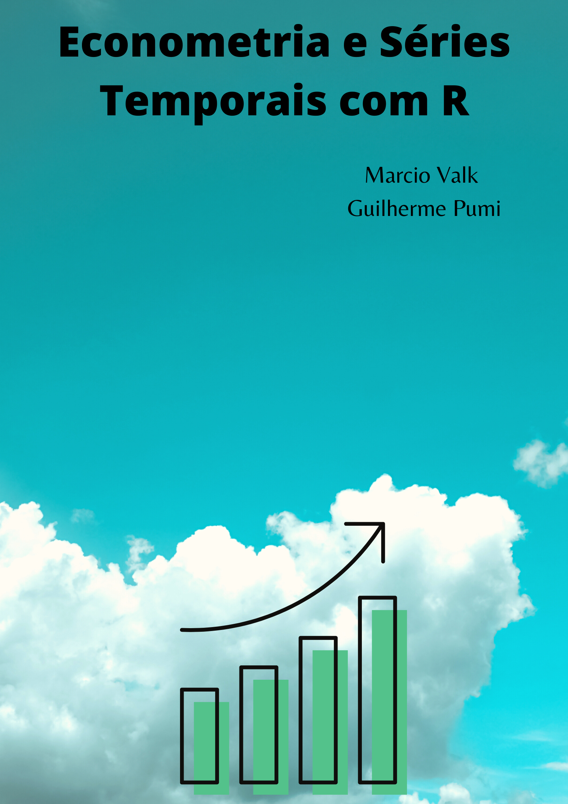

--- 
title: "Econometria e Séries Temporais com R"
author: "Marcio Valk e Guilherme Pumi"
date: "`r Sys.Date()`"
site: bookdown::bookdown_site
documentclass: book
bibliography: [book.bib, packages.bib]
biblio-style: apalike
link-citations: yes
geometry: margin=0.7in 
description: "Este livro pode ser usado em um curso de graduação que proponha estudar econometria e séreis temporais em um nível introdutório. No entanto, também é abordado um pouco da teoria e tecnicalidade."
---

# {-}

# Prefácio {-}

Este livro baseia-se nas notas de aula da Disciplina de Econometria que é oferecida pelo departamento de Estatística da UFRGS. Para cursar a disciplina é necessário ter alguns pré-requisitos, portanto é esperado que o leitor tenha algum tipo de conhecimento sobre estatística básica, inferência e regressão. 
